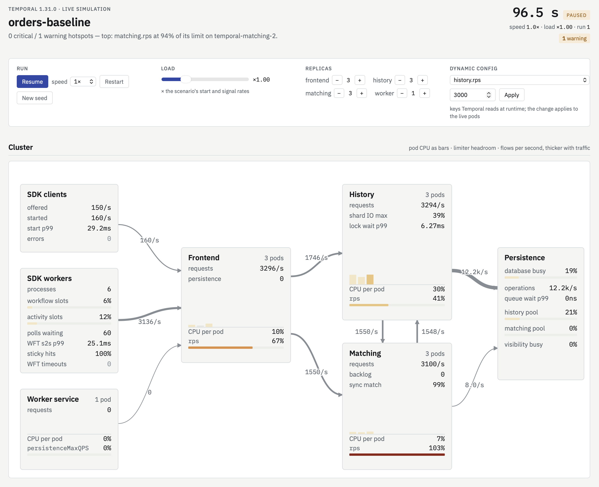
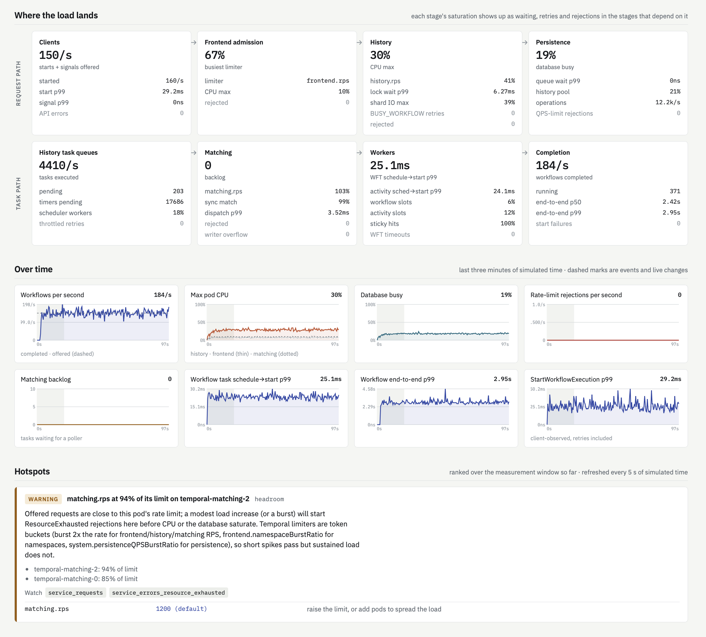

# tempdes

[](https://github.com/iw/tempdes/actions/workflows/ci.yml)
[](#license)
[](rust-toolchain.toml)

A discrete-event simulator that finds hotspots in **Temporal Server 1.31.0** clusters running on
EKS, before they show up in production.

You describe a deployment and a workload. Two dimensions are adjustable:

* **replica counts** for the frontend, history, matching and worker services;
* **dynamic config**, in Temporal's own file format, for the settings that matter most for
  throughput. 96 settings are simulated, and all 613 keys in 1.31.0 are validated.

tempdes simulates the cluster request by request and reports what saturates first: CPU, database
connections, a shard's IO semaphore, a single workflow's lock, a rate limiter, a history task
queue, a task-queue partition, or shard movement during a rollout. Each finding names the
Temporal metrics to watch and the dynamic config keys (or replica counts) that change it.

You can also give it **metrics your cluster already emits** (`persistence_latency`,
`service_requests`, CPU usage and others). tempdes uses them to calibrate database service times,
per-service CPU costs and workload rates. It then prints a table comparing its predictions with
your observed values.

```text
$ tempdes run examples/scenarios/hot-entity.yaml

  4 critical / 1 warning hotspots — top: workflow lock contention (lock wait p99 9.50s, 5998 BUSY_WORKFLOW
  timeouts). Busiest resource: shard 151 IO at 100%.

  CRITICAL #1  workflow-lock  workflow lock contention (lock wait p99 9.50s, 5998 BUSY_WORKFLOW timeouts)
             · CartWorkflow-0 (#0) (shard 363): lock 100% busy, wait p99 9.50s, 1921 busy-workflow timeouts
             watch: history_workflow_execution_cache_latency, acquire_lock_failed, task_errors_workflow_busy, …
             knob: history.cacheNonUserContextLockTimeout = 500ms (default)  — longer waits reduce retries …
  CRITICAL #2  shard  hot history shard 151 (100% IO busy, wait p99 2.02ms)
             Shard 151 is busy because workflow CartWorkflow-1 (#1) writes to it continuously … raising
             history.shardIOConcurrency or adding history pods will not help — the fix is fewer writes per
             workflow (batch signals, split the entity) or a faster database write.
```

---

## Contents

- [Install](#install)
- [Quick tour](#quick-tour)
- [Dimension 1: replica counts](#dimension-1-replica-counts)
- [Dimension 2: dynamic config](#dimension-2-dynamic-config)
- [Sweeps: replicas × dynamic config](#sweeps-replicas--dynamic-config)
- [Watching a run live](#watching-a-run-live)
- [Feeding in Temporal metrics](#feeding-in-temporal-metrics)
- [Importing workflow histories](#importing-workflow-histories)
- [Saved run profiles](#saved-run-profiles)
- [Reading the report](#reading-the-report)
- [Scenario reference](#scenario-reference)
- [Example scenarios](#example-scenarios)
- [What is modelled](#what-is-modelled)
- [Limitations](#limitations)
- [Development](#development)
- [Contributing](#contributing)
- [License](#license)

## Install

tempdes needs **Rust 1.98.1** or newer (edition 2024). To install the `tempdes` command from
this repository:

```bash
cargo install --locked --git https://github.com/iw/tempdes tempdes
```

To build from a clone instead, run the following. `rust-toolchain.toml` pins 1.98.1, and rustup
installs it on first use.

```bash
git clone https://github.com/iw/tempdes && cd tempdes
cargo build --release
```

The binary is `target/release/tempdes`. The simulator itself depends only on `serde`,
`serde-saphyr` (YAML), `serde_json`, `clap` and `anyhow`; the live view (`tempdes ui`) adds
the [Topcoat](https://github.com/tokio-rs/topcoat) web framework and tokio behind the default
`ui` feature (`--no-default-features` builds the lean command-line tool). The simulation runs
on a single thread per run. A 60-second simulation at 150 workflows/s takes one to two
seconds. Sweeps run their cells in parallel.

## Quick tour

```bash
# one configuration → hotspot report (exit code 1 if anything is critical)
tempdes run examples/scenarios/baseline.yaml

# change the two dimensions from the command line
tempdes run examples/scenarios/baseline.yaml -r history=6 -d history.shardIOConcurrency=4

# how clients reach the frontends: pinned connections, gRPC round robin or an L7 proxy
tempdes sweep examples/scenarios/frontend-lb.yaml --rows frontend=3,4 \
    --cols client_lb=pinned,round_robin,proxy

# grid: replica counts down, dynamic config across
tempdes sweep examples/scenarios/baseline.yaml --load 1.3 \
    --rows matching=3,4,6 --cols matching.rps=1200,2400 --html out/sweep.html

# watch a run live in the browser, changing load, replicas and dynamic config as it runs
tempdes ui examples/scenarios/baseline.yaml --open

# calibrate against production metrics, then compare predictions with observations
tempdes run examples/scenarios/baseline.yaml -o examples/metrics/observed.yaml

# save a run as a private, named profile and repeat it by name
tempdes profile save prod my-cluster.yaml -r history=4 -o observed.yaml
tempdes run --profile prod --load 1.5

# dynamic config tooling
tempdes dc modeled                       # the 100 simulated keys, with 1.31.0 defaults
tempdes dc explain history.shardIOConcurrency
tempdes dc validate examples/dynamicconfig/with-mistakes.yaml

# metrics tooling
tempdes metrics queries --window 15m     # PromQL to collect calibration inputs
tempdes metrics template > observed.yaml
tempdes metrics show examples/metrics/observed.yaml

# workloads from exported workflow histories (steps, durations, attempts, retry policies)
tempdes workload import histories/ --namespace orders --rate 150/s -o workflows.yaml
```

`run` also writes `--json` (the full result), `--prom` (simulated metrics in Prometheus text
format with Temporal metric names), `--html` (a self-contained report with time-series charts
and a shard map) and `--md` (the report as Markdown, with GitHub-flavoured tables for pull
requests, issues and docs). `-v` prints per-pod, per-shard and per-partition tables. `ui` takes the same
scenario and overrides and shows the run live in the browser.

## Dimension 1: replica counts

Replica counts come from `cluster.replicas` in the scenario:

```yaml
cluster:
  replicas: { frontend: 3, history: 6, matching: 3, worker: 1 }
  resources:                 # per-pod CPU limit → GOMAXPROCS
    history: { cpu: 4 }
```

You can also set them in these ways:

| How | Example |
|---|---|
| CLI override | `-r history=6 -r matching=4` |
| sweep rows | `--rows history=3,6,9` (repeat `--rows` for a cartesian product) |
| linked sweep rows | `--rows frontend+history=2+3,3+6,4+9` |
| Helm values | `cluster.helm_values: values-prod.yaml` reads `server.<svc>.replicaCount` |
| mid-run scaling | `events: [{ at: 50s, replicas: { history: 5 } }]` |

Replica counts change more than capacity. Each pod joins the ringpop hash ring under its
`ip:port`, so the replica count decides:

* **which history pod owns which shards.** Placement uses 100 virtual points per member, as in
  Temporal. With few pods, shard counts per pod are uneven.
* **where task-queue partitions live.** Partitions are placed on matching pods by the same ring,
  which also decides where the root partition sits.
* **how rate limits are split.** Settings such as `frontend.globalNamespaceRPS` are divided
  across frontend pods.
* **how SDK traffic spreads.** By default each client and worker keeps one gRPC connection
  pinned to one frontend pod until `frontend.keepAliveMaxConnectionAge` expires, so load is
  uneven across frontends. `cluster.network.client_lb` can instead model gRPC client-side round
  robin or an L7 proxy such as an ALB; see [docs/EKS.md](docs/EKS.md).

To reproduce the exact placement of a live cluster, list the pods' real addresses in
`cluster.member_addresses`.

Scaling while the simulation runs moves shards. The old owner closes them and the new owner
acquires them with `GetOrCreateShard` + `UpdateShard`, after a ringpop propagation delay.
Requests wait during the move, and the new owner starts with a cold mutable-state cache. The
`membership` hotspot and the `shard_unavailable` latency show the cost.

## Dimension 2: dynamic config

Dynamic config uses the server's own format, including constraints:

```yaml
dynamic_config_files: [ ../dynamicconfig/production.yaml ]   # applied first
dynamic_config:                                                # then these
  history.shardIOConcurrency:
    - value: 4
  frontend.namespaceRPS:
    - value: 5000
      constraints: { namespace: payments }
    - value: 2400
```

These keys are resolved the way Temporal 1.31.0 resolves them:

* **Scope and precedence.** Each key has a scope (Global, Namespace, TaskQueue, ShardID and so
  on). The most specific constraint match wins.
* **Case.** Key matching is case-insensitive.
* **Type conversion.** An int key given a float (`2500.0`) fails conversion and falls back to
  the default, as it does in the server.
* **Durations.** `"30s"`, `"1h"` and bare seconds are accepted.

CLI overrides use `-d key=value` and `-d 'key[namespace=orders,taskQueueName=q]=value'`.
Sweep columns use `--cols key=v1,v2,v3`. Two pseudo-keys also work: `load=0.5,1,2` scales all
start and signal rates, and `client_lb=pinned,round_robin,proxy` changes how clients reach the
frontends.

`tempdes dc validate FILE` checks a production dynamic config file against the 1.31.0 registry.
It exits 1 when it finds problems. It catches:

* typos, with did-you-mean suggestions;
* type mismatches;
* constraints that can never match the key's scope;
* write partitions set higher than read partitions.

Keys that are valid but not simulated are still validated and reported. When one of them is a
useful fix for a hotspot, the report marks it *(not simulated)*.

### Simulated settings (highlights)

Run `tempdes dc modeled` for the full list of 99 keys with their defaults and descriptions.

| Area | Keys |
|---|---|
| Frontend limits | `frontend.rps`, `frontend.globalRPS`, `frontend.namespaceRPS`, `frontend.globalNamespaceRPS`, `frontend.namespaceBurstRatio`, `frontend.namespaceCount` / `globalNamespaceCount`, `frontend.namespaceRPS.visibility` (+ global/burst), `frontend.pollWaitForNamespaceRateLimitToken`, `frontend.keepAliveMaxConnectionAge`, `system.operatorRPSRatio` |
| Persistence | `{frontend,history,matching,worker}.persistenceMaxQPS`, `{history,matching}.persistenceGlobalMaxQPS`, the per-namespace limits `{history,matching}.persistence{,Global}NamespaceMaxQPS` and `history.persistencePerShardNamespaceMaxQPS`, `system.persistenceQPSBurstRatio` |
| History | `history.rps`, `history.shardIOConcurrency`, `history.hostLevelCacheMaxSize`, `history.cacheNonUserContextLockTimeout`, `history.eventsCacheMaxSizeBytes`, `history.acquireShardConcurrency`, `history.defaultWorkflowTaskTimeout`, `history.defaultActivityRetryPolicy`, `history.longPollExpirationInterval` |
| Size limits | `limit.historySize.error`, `limit.historySize.warn`, `limit.blobSize.error`, `limit.blobSize.warn` |
| History task queues | `*ProcessorSchedulerWorkerCount`, `*TaskBatchSize`, `*ProcessorMaxPollRPS`, `*ProcessorMaxPollHostRPS`, `*ProcessorUpdateAckInterval`, `history.queuePendingTasksMaxCount`, `history.timerProcessorMaxTimeShift`, `history.shardUpdateMin{Interval,TasksCompleted}`, the task scheduler's rate limiter: `history.taskSchedulerEnableRateLimiter{,ShadowMode}`, `history.taskSchedulerRateLimiterStartupDelay`, `history.taskScheduler{,Global}{,Namespace}MaxQPS`, the scheduler's weights per priority `history.{transfer,timer,visibility}ProcessorSchedulerActiveRoundRobinWeights`, and the execution queue scheduler `history.taskSchedulerEnableExecutionQueueScheduler`, `history.taskSchedulerExecutionQueueScheduler{MaxQueues,QueueTTL,QueueConcurrency}` |
| Matching | `matching.rps`, `matching.numTaskqueue{Read,Write}Partitions`, `matching.forwarderMax{OutstandingPolls,OutstandingTasks,RatePerSecond,ChildrenPerNode}`, `matching.outstandingTaskAppendsThreshold`, `matching.maxTaskBatchSize`, `matching.getTasksBatchSize`, `matching.getTasksReloadAt`, `matching.maxWaitForPollerBeforeFwd`, `matching.backlogNegligibleAge`, `matching.longPollExpirationInterval`, `admin.matching*DispatchRate` |
| Worker service | `worker.perNamespaceWorkerCount`, `worker.schedulerNamespaceStartWorkflowRPS`, `worker.schedulerLocalActivitySleepLimit`, `worker.ESProcessor{BulkActions,FlushInterval,NumOfWorkers}` |
| Membership / features | `system.ringpopReplicaPoints`, `system.ringpopApproximateMaxPropagationTime`, `system.enableEagerWorkflowStart`, `system.enableActivityEagerExecution` |

Static config that behaves like a dimension is part of `cluster`: `numHistoryShards`, SQL
`maxConns` per pod, and the store type. With Cassandra, Temporal forces
`history.shardIOConcurrency` to 1, and tempdes does the same with a warning.

## Sweeps: replicas × dynamic config

```bash
tempdes sweep examples/scenarios/baseline.yaml --load 1.3 \
    --rows matching=3,4,6 --cols matching.rps=1200,2400
```

```text
STATUS (critical/warning hotspot count · top hotspot category)
  replicas \ dynamic config      matching.rps=1200    matching.rps=2400
  matching=3                 CRIT 1c/7w rate-limit  WARN 0c/2w headroom
  matching=4                 CRIT 1c/6w rate-limit  WARN 0c/2w headroom
  matching=6                   WARN 0c/3w headroom  WARN 0c/2w headroom

WORKFLOW END-TO-END p99
  matching=3                            12.85s              2.82s
  matching=4                            11.80s              2.82s
  matching=6                             2.82s              2.82s

RATE-LIMIT REJECTIONS /s
  matching=3                             243/s                  0
  matching=4                             201/s                  0
  matching=6                                 0                  0
```

In this sweep, going from 3 to 4 matching pods barely helps. Partitions are placed by the hash
ring, so one pod still carries too many of them. Six pods, or doubling `matching.rps`, fixes the
problem.

Each cell is a full simulation with the same seed. The output includes these grids:

* hotspot status;
* throughput;
* end-to-end p99;
* start latency;
* maximum CPU per service;
* database and hottest-shard utilisation;
* rate-limit rejections;
* the top hotspot per cell.

`--csv` and `--json` write every cell. `--html` writes a heatmap you can switch between metrics,
with per-cell detail. `--md` writes the same tables as Markdown.

## Watching a run live

```bash
tempdes ui examples/scenarios/baseline.yaml --open
tempdes ui examples/scenarios/db-bound.yaml --speed 5 -r history=6
```

`tempdes ui` serves the simulation as it runs, at a chosen multiple of real time (warm-up
runs at full speed). The page shows the cluster as a figure of the request paths, with CPU per
pod, the limiter closest to its limit on each service, and the flows between services; two
rows of stages, one for the request path (clients → frontend → history → persistence) and one
for the task path (history queues → matching → workers → completion), each with its own
saturation and the symptoms it causes in the next; three minutes of time series; and the
report's hotspots, re-ranked every five simulated seconds.

While it runs you can change the load multiplier, the replica count of each service and the
dynamic config keys Temporal re-reads at runtime. Each change is marked on the charts and the
timeline, so you can watch, say, `matching.rps` start rejecting polls, the backlog grow, and
workflow task schedule-to-start latency follow. [docs/UI.md](docs/UI.md) describes the page and
how it is built with the Topcoat web framework.

<p align="center">
  
</p>

<p align="center">
  
</p>

## Feeding in Temporal metrics

Observed metrics serve two purposes: **calibration** changes the model's parameters, and
**validation** compares the model's predictions with production.

```bash
tempdes metrics queries --window 15m   # the PromQL to run
tempdes metrics template               # an annotated observations file
tempdes run scenario.yaml -o observed.yaml
```

An observations file lists Temporal metric names with labels. Each entry gives a `rate`,
`increase` (with `window`), `value`, quantiles (`p50`/`p90`/`p99` or a `quantiles` map) or raw
histogram `buckets`:

```yaml
window: 15m
metrics:
  - name: persistence_latency
    labels: { operation: UpdateWorkflowExecution }
    p50: 3.4ms
    p99: 24ms
  - name: persistence_latency
    labels: { operation: GetTransferTasks }
    buckets: { "0.001": 5210, "0.002": 18020, "0.005": 26310, "0.01": 27950, "+Inf": 28570 }
  - name: container_cpu_usage_seconds_total
    labels: { container: temporal-history }
    rate: 3.9
  - name: service_requests
    labels: { service_name: frontend, operation: StartWorkflowExecution }
    rate: 180/s
```

You can also give raw Prometheus scrapes of the Temporal pods, either with `-o scrape.prom` or
in the observations file:

```yaml
prometheus: { before: scrape-0900.prom, after: scrape-0915.prom, interval: 15m }
```

Counters then become rates, and histograms become quantiles. Both tally names
(`persistence_latency_bucket`) and OpenTelemetry names (`temporal_persistence_latency_milliseconds_bucket`)
are recognised.

### What each metric informs

| Observed metric | Calibrates |
|---|---|
| `persistence_latency{operation}` | database service time per persistence operation. The observed distribution is fitted piecewise in log space, so heavy tails are kept, then scaled by a factor that pilot simulations adjust until the simulated mean latency, queueing included, matches the observed mean. The observed Create/UpdateWorkflowExecution latency includes the history append, so those writes add no separate `AppendHistoryNodes`. |
| `visibility_persistence_latency{operation}` | visibility store read/write latency |
| `persistence_requests{operation}` + `db_utilization` (or `rds_cpu_utilization`) | database capacity (concurrent operations before queueing) |
| `container_cpu_usage_seconds_total{container=temporal-<svc>}` (or `cpu_cores{service_name}`) | per-service CPU cost scale, from a pilot simulation of the observed configuration. Sweep cells reuse the same scale. |
| `service_requests{service_name=frontend, operation=StartWorkflowExecution / SignalWorkflowExecution}` | workload start and signal rates |
| `service_requests{service_name=frontend, operation=SignalWithStartWorkflowExecution / ExecuteMultiOperation}` | the start rates of types started with signal- or update-with-start; each call scales its own types. `ExecuteMultiOperation` also counts the SDK's re-sends of updates that waited out the long poll. |

Validation rows cover these values:

* request rates and `service_latency` p99 per API;
* persistence rates and latency;
* mutable-state cache miss ratio (`cache_requests` / `cache_miss`);
* sync-match ratio (`poll_success_sync` / `poll_success`);
* CPU cores per service;
* `approximate_backlog_count`.

In the calibrated example, history CPU is 3.96 simulated vs 3.90 observed, sync match 0.87 vs
0.78, and persistence p99s are within 5%.

Turn individual calibrations off in the scenario with
`calibration: { persistence_latency: false, cpu: false, workload: false }`.

`--load` and sweep `load=` columns multiply the calibrated workload. For example,
`-o observed.yaml --load 1.5` simulates 1.5× the observed start rate. CPU and persistence
calibration still come from pilot runs at the observed load. The comparison with observed
metrics is skipped, because the simulated workload is no longer the observed one.

## Importing workflow histories

Rather than writing a workflow's `steps` by hand, you can infer them from histories exported
from your cluster, a few hundred executions of each workflow type:

```bash
temporal workflow show --workflow-id <id> --output json > histories/<id>.json   # or the Web UI's download
tempdes workload import histories/ --namespace orders --rate 150/s -o workflows.yaml
```

The importer prints a `workflows:` block to paste into a scenario, a commented `workers:`
block to start the worker fleets from, and a summary of what it inferred. Both export spellings
are read (`EVENT_TYPE_ACTIVITY_TASK_SCHEDULED` and `ActivityTaskScheduled`, camelCase or
snake_case keys).

* **Steps.** The commands of one workflow task form a step: activities scheduled together run
  in parallel, `LocalActivity` markers are local activities run inside that task, a timer on its
  own is a sleep, and children started together are one child step. When a workflow task starts
  activities of several types, or activities and children, or children of several types, they
  make a `parallel` step with a member per type, each with its own durations, attempts and
  settings. A signal that wakes an idle
  workflow is a `wait_signal`, with the cancelled timer as its timeout; signals that arrive
  while the workflow is busy are buffered and left out.
* **Durations are each step's own time.** An activity's is its final attempt from start to
  close, and a workflow task's from start to completion. Waits in the cluster (schedule-to-start,
  throttled dispatch) are reported in the summary and left out, because a history from a busy
  cluster would otherwise build its queueing into the workload.
* **Attempts, retry policies and timeouts are as recorded.** A history keeps only an activity's
  final attempt, with its number and why its retries stopped. So `attempts` gets the recorded
  counts, `non_retryable` the activities that ended with a non-retryable error, and an activity
  whose retries ran out (its policy's attempts, or schedule-to-close) gets an attempt count it
  can't reach. An activity that waited in its queue past its schedule-to-start timeout is the
  recorded cluster's queueing, and is left out of the plans.
* **Failed attempts' durations are estimated.** The attempts before the last aren't recorded.
  Their run time is the time from scheduling to the last attempt's start, less the retry
  intervals of the policy and a typical queue wait per attempt; when the last attempt's
  `lastFailure` is a start-to-close timeout, the attempt before it ran to the timeout. With the
  run times of failed final attempts, they make `failed_duration`. Retry delays an activity
  sets itself (`NextRetryDelay`) aren't recorded, so the estimate assumes the policy's intervals.
* **Heartbeats aren't recorded,** so an activity with a heartbeat timeout is assumed to
  heartbeat at the Go SDK's throttle, 0.8 × the timeout.
* **Paths.** Executions of a type that took the same steps are pooled. A path taken by at least
  5% of them (`--min-path-share`) becomes a workflow type of its own (`OrderWorkflow~2`) with its
  share of the start rate; rarer paths are folded into the most common.
* **Start rate.** `--rate` sets it; otherwise it is estimated from the start times, which is
  right only if the export holds every execution in that time. Calibrating with observed
  `service_requests` (`-o`) also sets it.
* **Payload sizes are estimated.** Servers record on each workflow task the size of the history
  before it (`historySizeBytes`). Less 128 bytes an event and 256 a signal, over the events
  that carry payloads, that gives each type's `payload_bytes`. The summary gives the range for
  events of 95–180 bytes, and notes when events that aren't modelled (markers, search attribute
  upserts, updates) may inflate it. Histories that don't record their size leave the default.
* **Worker fleets are sketched.** Histories record which worker process started each task
  (its `identity`, `pid@host` by default), but not its pollers or slots. The `workers:` block
  has a fleet for each task queue with the number of processes seen; uncomment it and set the
  pollers and slots from your deployment. The count is low if the histories are a sample that
  missed some processes, and high if processes were replaced while the histories ran (a deploy,
  autoscaling). The summary lists the SDKs the workers report.
* **Privacy.** Payloads are never read, and worker identities, which name hosts, are counted
  but never written. The output does name your workflow and activity types and task queues:
  keep it with your private profiles, not in a repository.

Not modelled, and counted in the summary: updates, Nexus operations, search attribute upserts,
markers other than local activities, and continue-as-new (each run is imported as its own
execution). A child type whose histories weren't given is written as a stub with no steps.

## Saved run profiles

A profile saves a scenario with the options of a run under a name, so the run can be repeated
with `--profile NAME` on `run`, `sweep` and `ui`. The saved options are:

* replica counts and dynamic config;
* observed metrics;
* load, client load balancing, duration, warm-up and seed.

Options given on the command line apply on top of the profile.

A scenario file placed in the store as `<name>.yaml` is a profile too: `--profile <name>` runs
it, and `profile save NEW --profile <name> [options]` builds a saved profile on top of it.

```bash
tempdes profile save prod my-cluster.yaml -r history=4 --client-lb round_robin -o observed.yaml \
    --description "production, weekday peak"
tempdes run --profile prod                  # the saved run
tempdes run --profile prod --load 1.5       # the saved run at 1.5x load
tempdes sweep --profile prod --rows history=4,5,6 --cols load=1,1.5
tempdes profile save prod-6h --profile prod -r history=6     # a new profile based on prod
tempdes profile list
tempdes profile show prod
tempdes profile remove prod-6h
```

Profiles usually describe a real cluster, so they are kept private and outside any repository:

* **Location.** The store is `~/.config/tempdes/profiles`, or `%APPDATA%\tempdes\profiles` on
  Windows. `$XDG_CONFIG_HOME/tempdes/profiles` or `$TEMPDES_PROFILES` override it, and
  `tempdes profile dir` prints it.
* **Permissions.** Each profile is a directory holding `profile.yaml` and copies of the scenario
  and the observed-metrics files, including the scrape files they refer to. On Unix, the store's
  directories are created readable only by you (`0700`), and its files likewise (`0600`).
* **Standalone copies.** After saving, a profile runs even if the original files are deleted.
  Files the scenario itself refers to, such as Helm values or dynamic config files, are not
  copied: they are still read from the scenario's original folder, and `profile show` lists them.
* **Git warnings.** `profile save` warns when the store is inside a git working tree that doesn't
  ignore it. It also names any source file that is untracked and not ignored, so it could be
  committed by accident. For those, delete the file once the profile has its copy, or list it
  in `.git/info/exclude`, a local ignore file that is never pushed.

## Reading the report

The report opens with a headline, followed by ranked hotspots. Each hotspot has:

* a severity (`CRITICAL` / `WARNING` / `INFO`);
* a category;
* the evidence (the pods, shards, workflows or partitions involved);
* **watch**: the Temporal metrics that show the problem in production;
* **knob**: the dynamic config keys or replica counts that change it, with their current
  effective values.

A causal pass moves root causes above their symptoms. For example, a saturated database ranks
above the backlog and schedule-to-start latency it causes. A hot shard is attributed to the
single hot workflow writing to it.

| Category | Meaning |
|---|---|
| `throughput` | accepted starts fall short of the offered load, or workflows close more slowly than they start once their own run time (sampled from their steps, retries included) is allowed for, so the number running grows. Both use a Poisson 3σ test, so noise isn't flagged. Workflows that wait for signals without a timeout have no known run time and get only the start test. |
| `cpu`, `imbalance` | pod CPU saturation; uneven load across pods of one service |
| `database`, `connection-pool` | database busy; per-pod SQL `maxConns` pools saturated (bursty pools are labelled as such) |
| `shard` | a shard's IO semaphore is busy, or bursty write contention |
| `workflow-lock` | per-workflow mutable-state lock saturation and `BUSY_WORKFLOW` timeouts, and the execution queue scheduler's per-workflow queues when it is enabled |
| `history-queue` | transfer/timer/visibility task retries, throttling and scheduler backlog, with the throttle cause |
| `activity-timeouts` | activity schedule-to-start, start-to-close, schedule-to-close and heartbeat timeouts, and workflows failed because an activity failed for good |
| `visibility` | Elasticsearch bulk processor or visibility persistence saturation |
| `matching-backlog`, `matching-placement` | task backlogs and dispatch latency; uneven partition placement |
| `rate-limit` | limiters rejecting requests, e.g. `frontend.namespaceRPS`, `history.rps`, `matching.rps`, persistence QPS, `namespaceCount` |
| `headroom` | a limiter running at ≥70% of its limit on some pod, before rejections start |
| `cache`, `sticky-cache` | mutable-state / events cache misses; sticky-queue misses and non-sticky workflow tasks |
| `history-size` | workflows terminated as their history grew over `limit.historySize.error`, or histories over the warn limit |
| `workers`, `workflow-tasks` | worker slots or pollers limiting throughput; schedule-to-start latency; workflow task timeouts |
| `schedules` | schedule actions delayed or rate-limited on the per-namespace worker |
| `api-latency`, `api-errors` | client-observed p99 over `report.api_p99_slo`; error rates |
| `membership` | shards unavailable while they move between history pods |

The warning and critical utilisation thresholds (0.7 / 0.9) and the API SLO are set under
`report:` in the scenario.

## Scenario reference

```yaml
name: orders-baseline
seed: 7
warmup: 20s                   # discarded before measuring
duration: 60s                 # measured simulated time

cluster:
  helm_values: ../helm/values-prod.yaml    # optional: replicas, CPU, shards, SQL maxConns, dynamicConfig
  num_history_shards: 512
  replicas: { frontend: 3, history: 3, matching: 3, worker: 1 }
  resources: { frontend: { cpu: 2 }, history: { cpu: 4 }, matching: { cpu: 2 }, worker: { cpu: 1 } }
  member_addresses: { history: ["10.0.1.12:7234", "10.0.2.40:7234"] }   # optional, exact ring placement
  network:
    client_rtt: 2ms
    internal_rtt: 0.5ms
    client_lb: pinned          # pinned | round_robin | proxy (docs/EKS.md)
    proxy_latency: 1ms         # proxy only: added to every request
    proxy_discovery: 15s       # proxy only: before a new frontend pod gets traffic
  persistence:
    store: postgresql          # postgresql | mysql | cassandra | sqlite
    max_conns: { frontend: 20, history: 50, matching: 30, worker: 10 }
    capacity: 160              # concurrent DB operations before queueing (calibratable)
    # write_per_mib: 20ms, read_per_mib: 5ms   # time per MiB of history written / read
    latency:                   # per Temporal persistence operation, or `default`
      UpdateWorkflowExecution: { p50: 3ms, p99: 14ms }
  visibility: { store: elasticsearch }

dynamic_config_files: []
dynamic_config: { history.shardIOConcurrency: [ { value: 1 } ] }

namespaces: [ { name: orders } ]

workers:                       # SDK worker fleets (Go SDK behaviour)
  - name: order-workers
    namespace: orders
    task_queue: orders
    processes: 6
    workflow_pollers: 10       # MaxConcurrentWorkflowTaskPollers
    activity_pollers: 16
    workflow_slots: 200
    activity_slots: 200
    sticky_cache_size: 5000
    sticky_schedule_to_start_timeout: 5s
    # cpu: 2, task_queue_activities_per_second: 500, poll_timeout: 70s, eager_activities: false
    # rpc_timeout: 10s         # deadline of each respond/heartbeat/history call, retries included

workflows:
  - type: OrderWorkflow
    namespace: orders
    task_queue: orders
    start_rate: 150/s          # omit for child-only / schedule-only types
    arrival: poisson           # poisson | uniform
    # ramp: { from: 0.2, over: 30s }
    starters: 4                # client processes (each pins one frontend connection)
    # eager_start: false, await_result: false, rpc_timeout: 10s
    # start_with: start        # start | signal (signal-with-start) | update (update-with-start)
    # existing: 0.0            # with signal / update: share of calls to a running workflow
    wft_processing: { p50: 2ms, p99: 12ms }
    # replay_per_event: 50us, payload_bytes: 2KiB
    steps:
      - activity: { count: 1, duration: { p50: 30ms, p99: 250ms } }
      - activity: { count: 2, parallel: true, duration: { p50: 60ms, p99: 400ms },
                    failure_rate: 0.01, heartbeat: 10s, heartbeat_timeout: 30s,
                    start_to_close_timeout: 2m, schedule_to_start_timeout: 1m,
                    retry_initial: 1s, backoff_coefficient: 2, max_interval: 1m, max_attempts: 5,
                    on_failure: fail }     # fail | continue: when an activity fails for good
      - activity: { count: 1, duration: 3s, attempts: { 1: 0.8, 5: 0.18 },   # instead of failure_rate
                    non_retryable: { 1: 0.02 }, failed_duration: 200ms }
      - local_activity: { count: 1, duration: 5ms }
      - timer: 2s
      - child_workflow: { workflow_type: ShipmentWorkflow, count: 1 }
      - parallel:              # started by one workflow task; done when all are
          - activity: { count: 2, duration: 1s }
          - activity: { duration: 3s, attempts: { 1: 0.9, 3: 0.1 }, on_failure: continue }
          - child_workflow: { workflow_type: ShipmentWorkflow }
      - wait_signal: { count: 1, timeout: 1h }

load:                          # traffic that is not workflow starts; each takes an rpc_timeout
  signals:   [ { workflow_type: CartWorkflow, rate: 400/s, target: hot, hot_workflows: 3 } ]
  queries:   [ { workflow_type: OrderWorkflow, rate: 20/s } ]
  describes: [ { workflow_type: OrderWorkflow, rate: 10/s } ]
  visibility: [ { namespace: orders, rate: 5/s, op: list } ]

schedules:
  - { namespace: orders, count: 2000, interval: 1m, aligned: true, workflow_type: ReportWorkflow }

events:                        # changes during the run
  - { at: 50s, replicas: { history: 5 }, label: scale history }
  - { at: 80s, dynamic_config: { matching.rps: 2400 } }
  - { at: 90s, start_rate: { workflow_type: OrderWorkflow, rate: 300/s } }

calibration:
  observations: [ ../metrics/observed.yaml ]

costs:                         # CPU µs per operation, overriding the defaults
  history: { RespondWorkflowTaskCompleted: 900us, per_command: 120us }

report: { warn_utilization: 0.7, critical_utilization: 0.9, api_p99_slo: 500ms, top: 5 }
```

Durations and latencies accept a constant (`5ms`), `{ p50, p99 }` for a lognormal fit, a
`quantiles` map, `{ dist: exp, mean }` and `{ dist: uniform, min, max }`. Rates accept `150/s`,
`9000/m` or a bare number.

**SDK calls.** As in the Go SDK, each call has one deadline, `rpc_timeout` (10s by default),
and its retries happen inside it: a call still failing at the deadline returns
`DeadlineExceeded`. Worker polls use `poll_timeout` and aren't retried by the call itself, and a
client waiting for a result (`await_result`) long-polls the history for up to 65s. An
update-with-start call waits for its update instead: history holds it for up to
`history.longPollExpirationInterval` (20s), and while the update is still waiting the SDK sends
the call again, each attempt with a 60s deadline.

**Activities.** Retry-policy fields an activity leaves unset come from
`history.defaultActivityRetryPolicy` for its namespace (1s initial interval, coefficient 2, a
maximum interval of 100 × the initial one, unlimited attempts), as the server fills them in.
Timeouts are filled in as the server does: a schedule-to-close timeout bounds the others and
stands in for those not given, and the heartbeat timeout never exceeds start-to-close. An
activity with neither schedule-to-close nor start-to-close gets a start-to-close of ten times the
p99 of its `duration` or `failed_duration`, whichever is longer, between 10s and 1h (a real SDK
would refuse to schedule it), and an activity
that heartbeats without a `heartbeat_timeout` gets twice its heartbeat interval. Schedule-to-start
and schedule-to-close timeouts fail the activity; start-to-close and heartbeat timeouts retry the
attempt while the policy allows. An activity that fails for good fails its workflow, unless
the step says `on_failure: continue`.

`failure_rate` fails each attempt independently, which gives a geometric number of attempts with
a long tail. `attempts` instead sets how many attempts each activity makes, a count or shares
by count (`{ 1: 0.8, 5: 0.2 }`): the attempts before the drawn count fail and the last one
succeeds, unless the retry policy gives up first. `non_retryable` adds activities whose last
attempt fails with a non-retryable error, by that attempt (`{ 1: 0.02 }`), which the server
doesn't retry. With shares, `attempts` and `non_retryable` add up to 1; with a count or none,
the count (1 by default) applies to the other activities. The report counts non-retryable
failures apart from the others and doesn't raise them as hotspots: they are the scenario's
outcome, not a symptom. `failed_duration` sets how long a failed attempt runs (by default
`duration`): quick rejections run shorter, and attempts that hang past
`start_to_close_timeout` time out instead of failing. These are what `workload import` writes,
because a history records each activity's attempt count and why its retries stopped.

**Parallel steps.** A `parallel` step starts its members, `activity` and `child_workflow` steps,
in one workflow task, and ends when they all have, so it takes as long as the slowest. Each
member keeps its own settings: duration, attempts, retry policy, timeouts, task queue and
`on_failure`. An activity member that fails for good fails the workflow, unless that member says
`on_failure: continue`. An activity member's `count` activities all start together.

**Payloads.** `payload_bytes` (1 KiB by default) is the size of each input and result a
workflow type's history holds: the workflow's input and result, its activities' and children's
inputs and results, and its local activities' markers. Every event also weighs 128 bytes, and a
signal's input 256. Sizes cost time and room:

* a write takes `write_per_mib` (20 ms by default) for each MiB of history it appends, and a
  `ReadHistoryBranch` takes `read_per_mib` (5 ms) for each MiB it reads;
* each shard's events cache holds `history.eventsCacheMaxSizeBytes` (512 KiB) of events. An
  activity or child start, or a child reporting to its parent, that doesn't find its event
  there reads the whole batch the event was written in;
* a history over `limit.historySize.error` (50 MiB) is terminated at its next workflow task,
  and one over `limit.historySize.warn` (10 MiB) is counted;
* a `payload_bytes` over `limit.blobSize.error` (2 MiB) is refused when the scenario loads, and
  one over `limit.blobSize.warn` (512 KiB) runs with a warning.

## Example scenarios

| Scenario | What it shows |
|---|---|
| `baseline.yaml` | A healthy order workload at 150 wf/s. The first limit it hits is `matching.rps` on the busiest matching pod (the `headroom` warning). |
| `hot-entity.yaml` | Entity workflows with signal fan-in. A few "celebrity" workflows saturate their lock and shard, and more history pods don't help. |
| `frontend-throttling.yaml` | A cluster-wide `frontend.globalNamespaceRPS` split over four frontends plus pinned connections. Polls (priority 4) starve first. |
| `db-bound.yaml` | A small Aurora instance. The database and the SQL connection pools are the root cause, with backlog and timeouts as symptoms. |
| `schedules.yaml` | 2,000 schedules aligned to the minute. They are rate-limited by `worker.schedulerNamespaceStartWorkflowRPS` on the per-namespace worker. |
| `scale-out.yaml` | History scaled from 3 to 5 pods mid-run: shard movement, the unavailability window and cold caches. |
| `cassandra-large.yaml` | 4,096 shards on Cassandra at 1,000 wf/s, with shard IO forced to 1. Useful for sweeps. |
| `from-helm.yaml` | Deployment read from a `temporalio/helm-charts` values file. |
| `frontend-lb.yaml` | 270 wf/s on 3 frontends with default limits. Pinned SDK connections overload one frontend; `round_robin` or `proxy` spreads the load evenly. |
| `child-workflows.yaml` | Orders that each fan out to four shipment child workflows. Each start-child task holds the parent's lock through its child's start, so siblings start one after another, and each recorded start wakes the parent with a workflow task. |
| `with-start.yaml` | Carts updated through update-with-start and inboxes fed through signal-with-start. The cart workers fall behind, so update calls wait out the 20s long poll and are sent again, and the waiting calls overflow `frontend.namespaceCount`. |
| `frontend-scale-out.yaml` | Frontends scale from 3 to 6 mid-run. The new pods only get traffic once clients reconnect, re-resolve DNS or the proxy registers them. |

## What is modelled

[docs/MODEL.md](docs/MODEL.md) describes the mechanics with references to the Temporal 1.31.0
source. In summary:

* **Routing.**
  * Shards: `farm.Fingerprint32(namespaceID + "_" + workflowID) % numHistoryShards + 1`,
    checked against go-farm test vectors.
  * History pods and matching partitions: ringpop hash ring placement.
  * Clients: SDK connections pinned to frontend pods, gRPC client-side round robin, or an L7
    proxy (`cluster.network.client_lb`).
* **Frontend.**
  * `frontend.rps` and namespace priority rate limiters: higher priorities reserve tokens from
    lower ones, so worker polls and history long polls (priority 5 in the namespace limiter)
    starve first.
  * The long-running-request concurrency limit, which counts polls, queries and history long
    polls.
  * The visibility limiter.
* **History.**
  * Per-workflow lock, with API deadline versus the non-user lock timeout.
  * Host-level mutable-state LRU cache, and the shard events cache sized in bytes.
  * History size: payloads and events add bytes that writes and reads take time for, and
    histories over `limit.historySize.error` are terminated.
  * Shard IO semaphore.
  * Persistence priority rate limiters per pod, per namespace and per shard and namespace,
    which reject immediately.
  * `history.rps`.
  * Transfer, timer and visibility queues: reader rate limits and batching, pending-task limits,
    and the 512-worker scheduler, which interleaves namespaces and priorities by weight. The
    optional execution queue scheduler runs a busy workflow's tasks in their own queue. Failed
    tasks retry as in Temporal: resubmitted at once (once only when throttled), then backed off.
  * Timer lookahead and checkpoints.
  * Activity timeouts (schedule-to-start, start-to-close, schedule-to-close, heartbeat) on the
    timer queue, with the activity's retry policy deciding between a retry and failure.
* **Matching.**
  * The 1.31 matcher: sync match or backlog, and forwarding from child to root partitions.
  * Writer buffer overflow (`SystemOverloaded`), task batching and backlog reloads.
  * Sticky queues and `StickyWorkerUnavailable`.
* **Workers (Go SDK).**
  * Poller balancing between sticky and normal queues.
  * Slots and the sticky cache, with replay on a miss.
  * Eager workflow start and eager activities.
  * Activity heartbeats and failures, with each attempt stopping at its deadline.
  * Child workflows, signals with buffered events, and local activities.
  * Signal-with-start and update-with-start, with speculative workflow tasks for updates to
    running workflows.
* **Worker service.**
  * Scheduler workflows on the per-namespace worker.
  * Elasticsearch bulk processor.
* **Infrastructure.**
  * CPU as `GOMAXPROCS` cores per pod.
  * Per-pod SQL connection pools.
  * The database as a multi-server queue with per-operation service times. Cassandra LWT
    operations are slower.
  * Network round trips.
  * SDK retries with backoff, inside one deadline per call.

## Limitations

tempdes is a model. Use its findings to decide what to load-test and which metric to watch.
Don't treat them as guarantees.

* **CPU costs.** The default per-operation costs are estimates for mid-size pods. Calibrate them
  with `container_cpu_usage_seconds_total`, or override them under `costs:`. Absolute CPU
  numbers are not trustworthy until you do. Ratios and trends are more robust.
* **Database.** The database is a queue with independent service times. Lock contention inside
  the database, vacuum/compaction, and Cassandra LWT contention on one partition are not
  modelled beyond latency. Hot rows show up through the per-workflow lock and shard semaphore
  instead.
* **Features not modelled.**
  * Multi-cluster replication.
  * Nexus.
  * Workflow Update.
  * Worker Versioning.
  * CHASM-based schedulers.
  * Matchers other than the 1.31 default priority matcher. `matching.enableFairness` and
    `matching.useNewMatcher: false` are validated but not simulated.
  * Archival.
  * Batch operations.
  * GC pauses.
  * Pod restarts other than scaling.
* **SDK behaviour.** Workers follow the Go SDK's poller and sticky-cache behaviour. Other SDKs
  differ in detail.
* **History size.** Sizes cost database time only, not CPU or network. The size limit is checked
  when a workflow task completes, where Temporal checks it on every update, and the caller gets
  `NotFound` where Temporal returns `InvalidArgument`. The event count limit
  (`limit.historyCount.error`), the mutable state size limit and the gRPC message size limit are
  not enforced, and neither is continue-as-new.
* **Settings without an effect.** Dynamic config keys outside `tempdes dc modeled` are
  validated and shown, but they don't change the simulation.

## Development

These are the checks CI runs:

```bash
cargo fmt --all --check
cargo clippy --all-targets --locked
cargo test --locked         # unit tests + end-to-end scenario checks (tests/scenarios.rs)
cargo doc --no-deps --locked
cargo deny check            # licenses, advisories and sources (cargo install cargo-deny)
```

The end-to-end tests check that each example surfaces the hotspot it was built to show. They
also check that runs are deterministic for a given seed, and that replica and dynamic config
changes move results in the expected direction.

The dynamic config registry (`data/dynamicconfig-1.31.0.json`, embedded in the binary) is
generated from a Temporal source checkout by the `gen-dc-registry` binary. It finds every
`New<Scope><Type>Setting(...)` registration with a small Go lexer and evaluates constant
defaults such as `5*time.Minute`. The Temporal version is read from the source.

```bash
git clone --depth 1 --branch v1.31.0 https://github.com/temporalio/temporal ../temporal
cargo run --release --bin gen-dc-registry -- ../temporal -o data/dynamicconfig-1.31.0.json
```

With `--check data/dynamicconfig-1.31.0.json` instead of `-o`, it compares rather than writes.
It lists added, removed and changed settings, and exits 1 if the file is out of date.

Source layout:

* `src/sim/`: the deterministic async executor, semaphores, statistics and distributions.
* `src/model/`: the Temporal services.
* `src/config/`: the scenario, dynamic config, Helm import and the registry generator
  (`registry_gen.rs`, run by `src/bin/gen-dc-registry.rs`).
* `src/metrics/`: observations and the Prometheus parser.
* `src/calibrate.rs` and `src/run.rs`: calibration and single runs.
* `src/report/`: hotspot rules and the text, JSON, Prometheus and HTML outputs.
* `src/sweep.rs`: sweeps.
* `src/ui/`: the live view (`ui` feature): the simulation thread, frames, and the Topcoat
  pages, routes and client script.

## Contributing

Contributions are welcome: bug reports, scenarios that reproduce production behaviour, model
fixes backed by Temporal source references, and new hotspot rules. See
[CONTRIBUTING.md](CONTRIBUTING.md) for how to build, test and propose changes. Everyone taking
part is expected to follow the [code of conduct](CODE_OF_CONDUCT.md). Please report security
issues privately, as described in [SECURITY.md](SECURITY.md).

## License

Licensed under either of

* Apache License, Version 2.0 ([LICENSE-APACHE](LICENSE-APACHE) or
  <https://www.apache.org/licenses/LICENSE-2.0>)
* MIT license ([LICENSE-MIT](LICENSE-MIT) or <https://opensource.org/licenses/MIT>)

at your option.

Unless you explicitly state otherwise, any contribution intentionally submitted for inclusion in
the work by you, as defined in the Apache-2.0 license, shall be dual licensed as above, without any
additional terms or conditions.

Parts of tempdes are derived from go-farm and ringpop-go, and the dynamic config registry is
extracted from Temporal. [THIRD_PARTY_NOTICES.md](THIRD_PARTY_NOTICES.md) has their notices.
tempdes is an independent project and is not affiliated with or endorsed by Temporal Technologies.
